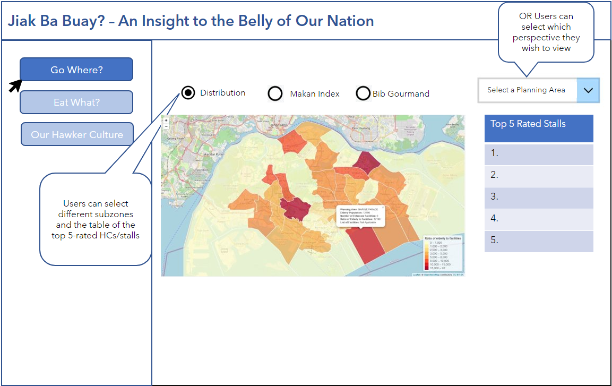
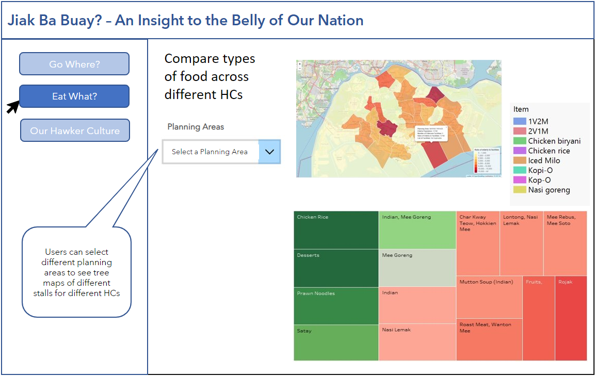
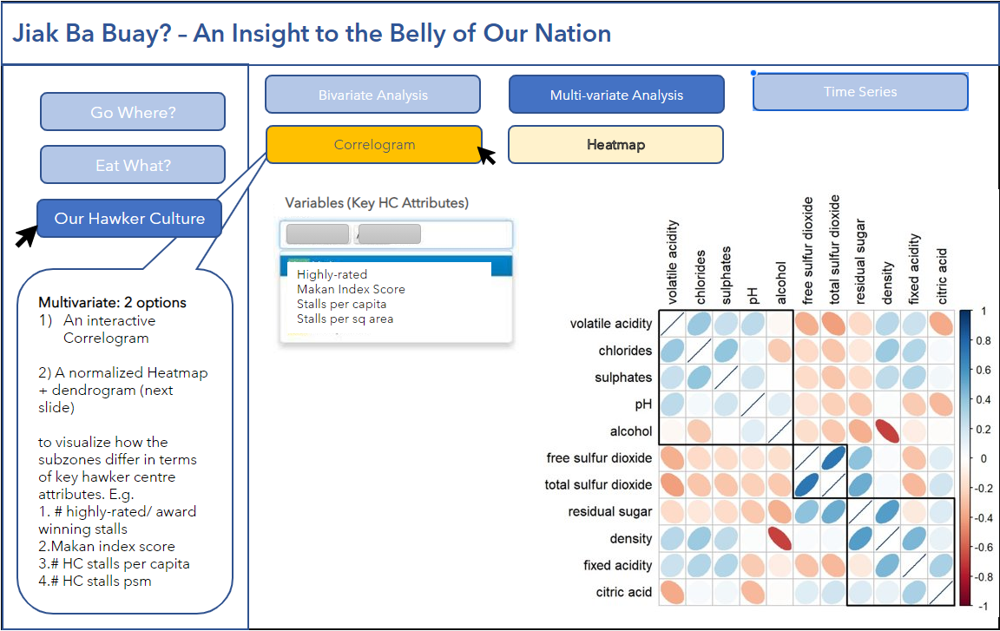
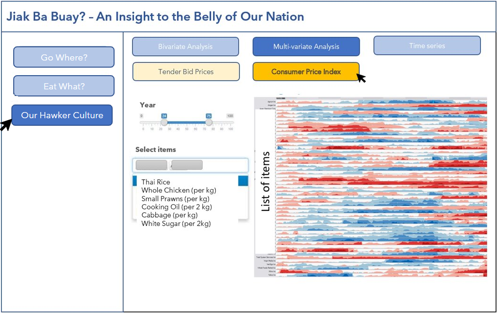
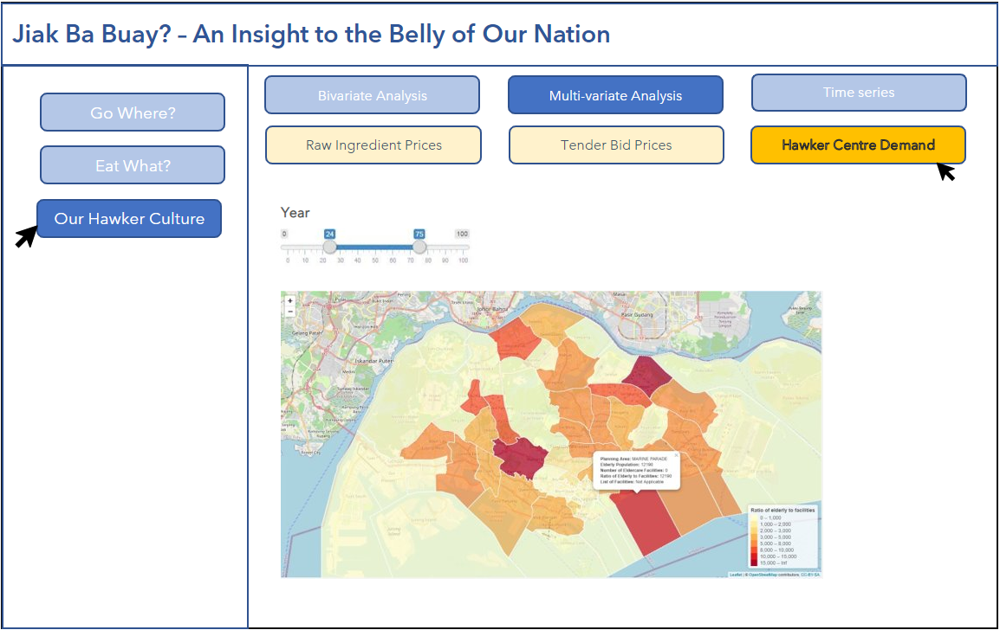

```{r setup, include=FALSE, results='asis'} 

options(htmltools.dir.version = FALSE, knitr.duplicate.label = "allow") 

knitr::opts_chunk$set(fig.retina = 3, cache = FALSE, echo = TRUE, message = FALSE, warning = FALSE) 

``` 

# 1. Impetus 


Hawker centres are the lifeblood of Singaporean society, providing ubiquitous access to a wide variety of affordable food to all residents islandwide. In recent years, there has been growing unhappiness regarding rising costs of ingredients and overheads to run a hawker stall. *Is hawkerpreneurship still a viable form of business and is eating at hawker centres still accessible to the average Singaporean?* 

Hawker culture was recognised as Singapore’s first element on the UNESCO Representative List of the Intangible Cultural Heritage of Humanity, cementing its role as an integral part of the way of life for Singaporeans. Singapore’s hawkers have also won many Bib Gourmands, a pinnacle international gastronomic award for high quality foods. It is often said that eating is a Singaporean national past-time. However, the sustainability of hawker culture remains questionable as the younger generation are discouraged by rising costs and long hours. *How has hawker economics performed in the past decade and how will it be affected in the future?* 

 

# 2.	Objective 

Develop a Shiny Application that allows users to: 

 
1. Explore the nature of the relationships, if any, between hawker centres and resident demographics in Singapore 

2. Examine the affordability of hawker food and changes in costs of running a hawker business over a period of 12 years from 2010-2021, with a specific focus on the impact of the COVID-19 pandemic, if any. 

3.  Develop a regression model to predict hawker economics of raw materials and tender bids in the future 

 

# 3. Timeline 

 
The proposed timeline for this project is as follows: 

```{r out.width='3500px', out.extra='style="float:left; padding:10px"', echo = FALSE}


```

# 4. Data sources 

The following data sets were used for the analyses: 

1. [Hawker Centre Locations with Coordinates](https://gist.github.com/raphodn/eecc3d8f6a5a04793385f44aa8304e30#file-hawker-centres-kml-csv). 
2. Hawker stall ratings and food type were obtained from [Hawkerpedia.com](https://www.hawkerpedia.com.sg/en/directories). 
3. Singapore demographic data,*Singapore Residents by Planning Area/ Subzone, Age Group, Sex, Type of Dwelling, June 2011-2020*, was obtained from [Singstat](https://www.singstat.gov.sg/find-data/search-by-theme/population/geographic-distribution/latest-data).  
4. The Makan Index, an affordability score, was obtained from the LKY School of Public Policy [report](https://lkyspp.nus.edu.sg/docs/default-source/ips/Report_Makan-Index-2nd-ed-final.pdf). 
5. Average retail prices of selected consumer items from 2010-2022 were obtained from [Consumer Price Index, January 2022](https://www.singstat.gov.sg/whats-new/latest-news/cpi-highlights). 
6. Hawker stall tender bids were obtained from the National Environment Agency's website, [NEA](https://www.nea.gov.sg/corporate-functions/resources/tender-notices). 


# 5. Methodology 

The group intends to conduct descriptive, inferential and time-series analysis on the datasets in order to glean important information about hawker centres as well as the possible correlations that are able to be drawn from it.

## Descriptive Analysis

In this section, an overall visualisation will be created to showcase general hawker information such as distribution of hawker centres in Singapore by planning area as well as top recommended hawker stalls in that area. 

```{r out.width='3500px', out.extra='style="float:left; padding:10px"', echo = FALSE}


```

Another page showcases the detailed breakdown of hawker centres as well as their types of food available. Furthermore, reviews left by previous customers online have been tabulated and colour-coded to give the user an idea of the quality of food at the hawker centre.

```{r out.width='3500px', out.extra='style="float:left; padding:10px"', echo = FALSE}


```   


## Inferential Analysis

As one of our main objectives are to explore the nature of the relationships, if any, between hawker centres and resident demographics in Singapore, both bivariate and multivariate analysis will be applied to the datasets available in order to draw possible correlations from them.

The visualisation will be made interactive to allow users to do bivariate analysis and explore any correlations or associations between the number of hawker centres, and the resident demographic attributes in Singapore. Also, a scatterplot/stacked bar chart with significance test can be implemented. 

```{r out.width='3500px', out.extra='style="float:left; padding:10px"', echo = FALSE}


```

Besides bivariate analysis, an interactive corrgram or heatmap and dendogram can be used to visualize how the planning areas differ in terms of key planning area attributes. Some attributes include:

1) Population: No. of elderly/ young, Percentage of elderly/ young
2) Housing type: Public (Small), Public (Large), Private
3) Affordability: Makan Index

(*The Makan Index is a base index that compares prices across geographical areas, using the price of a basket of hawker food items across different areas of Singapore.*)

4) Accessibility: No. of hawker stalls per capita/ square area
5) Rating: Average Rating (0 - 100%, with 100% being the most positive)


```{r out.width='3500px', out.extra='style="float:left; padding:10px"', echo = FALSE}


```

```{r out.width='3500px', out.extra='style="float:left; padding:10px"', echo = FALSE}


```


## Time-Series Analysis

Tying in with our original objective to examine the affordability of hawker food as well as predicting hawker economics such as costs of raw materials and prices of tender bids, our team will employ time-series analysis to visualise the following:

1) Changes in monthly average retail prices of selected raw ingredients
2) Changes in tender bid prices per square metre for different types of cooked food and market stalls

The above two points will be visualised in the form of a horizon graph in order to show the differences across a period of time.

```{r out.width='3500px', out.extra='style="float:left; padding:10px"', echo = FALSE}


```


Next, we would also conduct forecasting using regression on the following:

1) Future retail prices of selected raw ingredients
2) Future tender bid prices per square metre for different types of cooked food and market stalls
3) Population growth in planning areas

This would help budding hawker stall owners plan ahead for the future and identify areas where hawker stalls would be high in demand. 

```{r out.width='3500px', out.extra='style="float:left; padding:10px"', echo = FALSE}


```


# 6. References 

 

1. [Can Singapore Keep It's Precious Hawker Culture Alive?, The  Diplomat, January 2021](https://thediplomat.com/2021/01/can-singapore-keep-its-precious-hawker-culture-alive/). 
2. [58% of hawkers whose tenancies were up for renewal from April to June had rentals revised down, CNA, 6 July 2021](https://www.channelnewsasia.com/singapore/hawker-centre-rent-increase-kf-seetoh-nea-amy-khor-1990721). 
3. [Keeping Char Kway Teow Cheap - At What Price?, LKY School of Public Policy, 2015](https://lkyspp.nus.edu.sg/docs/default-source/case-studies/hawker-centre-case-study.pdf?sfvrsn=2bc7960b_2). 